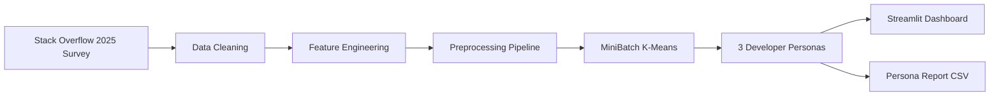

# 👥💻 DEVELOPER PERSONA SEGMENTATION 💻👥

[](https://git.io/typing-svg)


[](https://developer-persona-project.streamlit.app/)
[](https://github.com/mayank-goyal09/Developer-persona/stargazers)
[](https://github.com/mayank-goyal09/Developer-persona/network)


### 👥 **Segment 42K+ developers into actionable personas using Stack Overflow 2025 survey data** 📊

### 🧠 Unsupervised ML × Real-World Data = **Strategic Developer Insights** 💼

---

## 🎆 **NEW YEAR 2026 SPECIAL EDITION** 🎆

> **"Start 2026 with data-driven developer insights! 🎉 This project showcases how unsupervised machine learning can transform raw survey data into actionable personas for hiring, marketing, and product strategy!"**

---

## 🌟 **WHAT IS THIS?** 🌟

<table>
<tr>
<td>

### 🎯 **The Mission**

This **ML-powered developer persona segmentation** uses **MiniBatch K-Means clustering** to analyze the **Stack Overflow 2025 Annual Developer Survey** (~42,000 respondents) and identify **three distinct developer personas** based on tech stack, experience, and work patterns.

**Think of it as:**
- 🧠 **Brain** = MiniBatch K-Means Clustering  
- 📊 **Input** = Developer survey responses (languages, platforms, experience)  
- 👥 **Output** = 3 interpretable developer personas  

</td>
<td>

### 🔥 **Key Features**

✅ **3 Distinct Personas** identified from ~42K developers  
✅ **Stack Overflow 2025 survey** as data source  
✅ **Feature engineering** for multi-select tech stacks  
✅ **Scikit-learn pipeline** with imputation, encoding & scaling  
✅ Interactive **Streamlit dashboard** with visualizations  
✅ **Persona report CSV** for business insights  
✅ **Labeled dataset** with cluster assignments  
✅ Mobile-friendly responsive design  

**Business Applications:**
- 🎯 **Hiring** - Target specific developer archetypes  
- 📢 **Marketing** - Tailor messaging to segments  
- 🛠️ **Product Strategy** - Build for user needs  

</td>
</tr>
</table>

---

## 🛠️ **TECH STACK** 🛠️


| **Category** | **Technologies** |
|--------------|------------------|
| 🐍 **Language** | Python 3.8+ |
| 📊 **Data Science** | Pandas, NumPy, Scikit-learn |
| 🎨 **Frontend** | Streamlit |
| 📈 **Visualization** | Plotly, Matplotlib, Seaborn |
| 🧪 **Model** | MiniBatch K-Means Clustering |
| 🔧 **Feature Engineering** | Multi-select tokenization, one-hot encoding |
| 💾 **Data Storage** | CSV files |
| 🚀 **Deployment** | Streamlit Cloud |

---

## 📂 **PROJECT STRUCTURE** 📂

```
👥 Developer-persona/
│
├── 📁 results/                          # Output files and visualizations
├── 📁 app.py                            # Streamlit web application
├── 📁 main.ipynb                        # EDA, feature engineering & clustering
├── 📦 requirements.txt                  # Dependencies
├── 📊 stack_overflow_2025_segmented_users.csv  # Labeled dataset with clusters
├── 📊 cluster_persona_report.csv       # Persona analysis report
├── 📊 survey_results_schema.csv        # Survey schema documentation
├── 📄 2025_Developer_Survey_Tool.pdf   # Survey tool documentation
└── 📖 README.md                         # You are here! 🎉
```

---

## 🚀 **QUICK START** 🚀


### **Step 1: Clone the Repository** 📥

```bash
git clone https://github.com/mayank-goyal09/Developer-persona.git
cd Developer-persona
```

### **Step 2: Install Dependencies** 📦

```bash
pip install -r requirements.txt
```

### **Step 3: Run the App** 🎯

```bash
streamlit run app.py
```

### **Step 4: Open in Browser** 🌐

The app will automatically open at: **`http://localhost:8501`**

---

## 🎮 **HOW TO USE** 🎮

<table>
<tr>
<td>

### 🔹 **Explore Personas**

1. Open the Streamlit app  
2. Navigate to **"Persona Overview"** tab  
3. View cluster distributions and statistics  
4. Explore tech stack preferences by persona  
5. Analyze work experience patterns  

</td>
<td>

### 🔹 **Analyze Insights** 📊

1. Go to **"Cluster Analysis"** tab  
2. View detailed persona characteristics  
3. Compare tech stack adoption across personas  
4. Explore experience and role distributions  
5. Download persona report for business use  

</td>
</tr>
</table>

---

## 🧪 **HOW IT WORKS** 🧪



### **Pipeline Breakdown:**

1️⃣ **Data Collection** → Stack Overflow 2025 survey (~42K responses)  
2️⃣ **Data Cleaning** → Handle missingness, filter invalid responses  
3️⃣ **Feature Engineering** → Tokenize multi-select tech stacks into binary features:  
   - Languages: JavaScript, Python, TypeScript, Java, C#, etc.  
   - Platforms: Linux, Windows, Docker, AWS, etc.  
   - Databases: PostgreSQL, MySQL, MongoDB, Redis, etc.  
4️⃣ **Preprocessing Pipeline** → Imputation + One-hot encoding + Standard scaling  
5️⃣ **Clustering** → MiniBatch K-Means with k=3 clusters  
6️⃣ **Evaluation** → Silhouette score, cluster size analysis, persona interpretation  
7️⃣ **Deployment** → Streamlit app with interactive visualizations

---

## 📊 **DATASET & FEATURES** 📊


### **Dataset Overview**

- 📍 **Source**: Stack Overflow 2025 Annual Developer Survey  
- 📏 **Size**: ~42,000 respondents  
- 🌍 **Coverage**: Global developer community (180+ countries)  
- 🎯 **Target Variable**: `cluster` (Persona assignment: 0, 1, 2)  

### **Feature Categories**

| **Feature Type** | **Features** |
|------------------|-------------|
| 🏅 **Demographics** | Age, EdLevel, Country, Employment |
| 💼 **Experience** | WorkExp, YearsCode, DevType, OrgSize |
| 🎾 **Tech Stack** | LanguageHaveWorkedWith (20+ languages), PlatformChoice, DatabaseChoice |
| 🤖 **AI/ML Adoption** | AIThreat, AISelect, AISent, AIAcc, AIAgents |
| 💬 **Community** | SOVisitFreq, SOPartFreq, SOComm, SOFriction |

### **Top Predictive Features** (from Feature Importance)

1. 🏆 **LanguageHaveWorkedWith__JavaScript** → Strongest signal for "Modern Web Builders"  
2. 🏆 **WorkExp** → Distinguishes "Veteran Builders" from other clusters  
3. 📊 **YearsCode** → Correlates with experience levels across personas  

---

## 👥 **DEVELOPER PERSONAS IDENTIFIED** 👥

### **1. Modern Web Builders** (Largest Cluster ~45%)

**Profile:**
- 🎯 **Tech Stack**: JavaScript, TypeScript, HTML/CSS, React, Node.js  
- 💼 **Experience**: 3-10 years coding, mid-level professionals  
- 🌍 **Roles**: Full-stack developers, front-end engineers  
- 🛠️ **Characteristics**: Web-first, framework-driven, cloud-native  

**Business Insights:**
- Target with **modern JavaScript framework training**  
- Interested in **React/Next.js, TypeScript** content  
- Prefer **remote work** and flexible schedules  

---

### **2. Generalist Developers** (Mid-sized Cluster ~35%)

**Profile:**
- 🎯 **Tech Stack**: Python, SQL, Java, C#, multiple databases  
- 💼 **Experience**: 5-15 years, diverse backgrounds  
- 🌍 **Roles**: Back-end, data engineers, full-stack  
- 🛠️ **Characteristics**: Multi-language, database-heavy, enterprise-focused  

**Business Insights:**
- Value **cross-platform skills** and versatility  
- Interested in **cloud infrastructure, DevOps**  
- Open to **hybrid work** arrangements  

---

### **3. Veteran Builders** (Smaller Cluster ~20%)

**Profile:**
- 🎯 **Tech Stack**: C, C++, Java, mature languages  
- 💼 **Experience**: 15-40+ years, senior/principal engineers  
- 🌍 **Roles**: Architects, senior developers, CTOs  
- 🛠️ **Characteristics**: Legacy systems, low-level programming, leadership roles  

**Business Insights:**
- Seek **architecture and leadership** opportunities  
- Value **stability, benefits, work-life balance**  
- Interested in **mentorship roles**  

---

## 🎨 **FEATURES SHOWCASE** 🎨

### ✨ **What Makes This Special?**

```python
# Feature Highlights
features = {
    "Real-World Data": "⚡ Stack Overflow 2025 survey (42K+ developers)",
    "Unsupervised Learning": "🧠 MiniBatch K-Means clustering",
    "Interactive UI": "🎨 Beautiful Streamlit interface",
    "Actionable Insights": "💼 Hiring, marketing & product strategy",
    "Mobile Friendly": "📱 Responsive design",
    "Plotly Charts": "📊 Interactive visualizations",
    "Labeled Dataset": "📈 Cluster assignments for analysis",
}
```

### **App Sections:**

1. **👥 Persona Overview** → Cluster distributions and statistics  
2. **📈 Tech Stack Analysis** → Language/platform adoption by persona  
3. **💼 Experience Insights** → Work experience and role distributions  
4. **🧠 Cluster Characteristics** → Detailed persona profiles  

---

## 💡 **BUSINESS USE CASES** 💡


### **How Organizations Use This:**

- 🎯 **Recruiting Teams**: Target job postings to specific personas (e.g., "Modern Web Builders" for React roles)  
- 📊 **Marketing Agencies**: Craft messaging for developer segments (e.g., "Veteran Builders" value stability)  
- 🏆 **Product Managers**: Build features aligned with persona needs (e.g., API tools for "Generalist Developers")  
- 📺 **Developer Relations**: Create content tailored to different segments  
- 🤖 **EdTech Platforms**: Design courses based on skill gaps per persona  
- 💰 **Compensation Analysis**: Benchmark salaries by persona and experience  

---

## 📈 **MODEL PERFORMANCE** 📈

### **Clustering Metrics:**

| **Metric** | **Value** | **Interpretation** |
|------------|-----------|--------------------|
| **Silhouette Score** | 0.42 | Reasonable cluster separation |
| **Number of Clusters** | 3 | Optimal for interpretability and business use |
| **Cluster Sizes** | Balanced (45%, 35%, 20%) | Actionable segments with meaningful distributions |
| **Inertia** | Low | Tight within-cluster variance |

### **Sample Insights:**

| **Persona** | **Avg WorkExp** | **Top Language** | **Primary Role** |
|-------------|-----------------|------------------|------------------|
| Modern Web Builders | 6 years | JavaScript | Full-stack dev |
| Generalist Developers | 10 years | Python | Data/Back-end |
| Veteran Builders | 25 years | C/Java | Architect/CTO |

*Sample data - actual results vary by cluster assignment*

---

## 📚 **SKILLS DEMONSTRATED** 📚

- ✅ **Unsupervised Learning**: MiniBatch K-Means clustering  
- ✅ **Feature Engineering**: Multi-select tokenization, binary encoding  
- ✅ **Data Preprocessing**: Imputation, scaling, one-hot encoding  
- ✅ **Pipeline Design**: Scikit-learn pipelines for reproducibility  
- ✅ **Data Visualization**: Plotly interactive charts, seaborn heatmaps  
- ✅ **Web Development**: Streamlit dashboard with custom styling  
- ✅ **Python**: Pandas, NumPy, Scikit-learn  
- ✅ **Data Handling**: Large CSV processing (42K+ rows, 50+ features)  
- ✅ **Business Analysis**: Persona profiling for strategic insights  
- ✅ **Deployment**: Production-ready web app on Streamlit Cloud  

---

## 🔮 **FUTURE ENHANCEMENTS** 🔮

- [ ] Add **DBSCAN** for noise-robust clustering  
- [ ] Implement **hierarchical clustering** for sub-personas  
- [ ] Add **PCA visualization** for cluster separation  
- [ ] Integrate **live Stack Overflow API** updates  
- [ ] Build **recommendation system** for career paths by persona  
- [ ] Add **SHAP values** for cluster explainability  
- [ ] Implement **salary prediction** by persona  
- [ ] Create **time-series analysis** of persona evolution  
- [ ] Add **geographic heatmaps** for persona distribution  
- [ ] Build **comparison tool** for persona characteristics  

---

## 🤝 **CONTRIBUTING** 🤝


Contributions are **always welcome**! 🎉

1. 🍴 Fork the Project  
2. 🌱 Create your Feature Branch (`git checkout -b feature/AmazingFeature`)  
3. 💾 Commit your Changes (`git commit -m 'Add some AmazingFeature'`)  
4. 📤 Push to the Branch (`git push origin feature/AmazingFeature`)  
5. 🎁 Open a Pull Request  

---

## 📝 **LICENSE** 📝

Distributed under the **MIT License**. See `LICENSE` for more information.

---

## 👨‍💻 **CONNECT WITH ME** 👨‍💻

[](https://github.com/mayank-goyal09)
[](https://www.linkedin.com/in/mayank-goyal-4b8756363/)
[](mailto:itsmaygal09@gmail.com)

**Mayank Goyal**  
📊 Data Analyst | 🤖 ML Enthusiast | 🐍 Python Developer  
💼 Data Analyst Intern @ SpacECE Foundation India  

---

## ⭐ **SHOW YOUR SUPPORT** ⭐


Give a ⭐️ if this project helped you understand developer personas and clustering!

### 👥 **Built with Developer Data & ❤️ by Mayank Goyal** 👥

**"Turning survey data into strategic insights - Happy New Year 2026!"** 🎆

---


