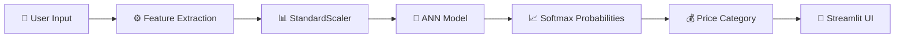

# 📱💰 SMARTPHONE PRICE PREDICTOR 💰📱

[](https://git.io/typing-svg)

<!-- Animated Wave Divider -->


<!-- Badges -->
<p align="center">
  
  
  
  
  
</p>

<p align="center">
  <a href="https://ram-project.streamlit.app/">
    
  </a>
  <a href="https://github.com/mayank-goyal09">
    
  </a>
  
</p>

<!-- Animated Banner GIF -->
<p align="center">
  
</p>

---

## 🌟 **WHAT IS THIS PROJECT?** 🌟

<table>
<tr>
<td width="50%">

### 🎯 **The Mission**

An **AI-powered smartphone price prediction system** that uses a **Multi-Layer Perceptron (ANN)** to classify smartphones into **4 price categories** based on **20+ hardware specifications**.

**Think of it as:**
- 🧠 **Brain** = Artificial Neural Network (ANN)  
- 📊 **Input** = Hardware specs (RAM, Battery, Camera, etc.)  
- 💰 **Output** = Price range (Budget → Flagship)  

</td>
<td width="50%">

### 🔥 **Key Features**

✅ **4-Class Classification** → Budget, Mid-Range, Premium, Flagship  
✅ **20+ Input Features** → Comprehensive hardware analysis  
✅ **Real-time Predictions** → Instant price estimation  
✅ **Premium Dark UI** → Stunning neon green glassmorphism theme  
✅ **Interactive Sliders** → User-friendly configuration  
✅ **Confidence Scores** → Probability distribution for each class  
✅ **Mobile Responsive** → Works on all devices  

**Price Categories:**
- 💚 **Budget** → ₹5,000 - ₹12,000  
- 💛 **Mid-Range** → ₹12,000 - ₹25,000  
- 🧡 **Premium** → ₹25,000 - ₹50,000  
- 💎 **Flagship** → ₹50,000+  

</td>
</tr>
</table>

---

## 🛠️ **TECH STACK** 🛠️

<p align="center">
  
</p>

| **Category** | **Technologies** |
|--------------|------------------|
| 🐍 **Language** | Python 3.8+ |
| 🧠 **Deep Learning** | TensorFlow 2.x, Keras |
| 📊 **Data Science** | Pandas, NumPy, Scikit-learn |
| 🎨 **Frontend** | Streamlit |
| 📈 **Visualization** | Matplotlib, Plotly |
| 🔧 **Preprocessing** | StandardScaler |
| 🚀 **Deployment** | Streamlit Cloud |

---

## 🧠 **NEURAL NETWORK ARCHITECTURE** 🧠

<p align="center">
  
</p>

```
┌──────────────────────────────────────────────────────────────┐
│                    📱 INPUT LAYER (20 features)               │
│  Battery • RAM • Storage • Camera • Display • Weight • etc.  │
└──────────────────────────┬───────────────────────────────────┘
                           │
                           ▼
┌──────────────────────────────────────────────────────────────┐
│                    🔷 HIDDEN LAYER 1                          │
│                    Dense(128) + ReLU                          │
│                    Dropout(0.3)                               │
└──────────────────────────┬───────────────────────────────────┘
                           │
                           ▼
┌──────────────────────────────────────────────────────────────┐
│                    🔷 HIDDEN LAYER 2                          │
│                    Dense(64) + ReLU                           │
│                    Dropout(0.2)                               │
└──────────────────────────┬───────────────────────────────────┘
                           │
                           ▼
┌──────────────────────────────────────────────────────────────┐
│                    💰 OUTPUT LAYER                            │
│                    Dense(4) + Softmax                         │
│          [Budget, Mid-Range, Premium, Flagship]               │
└──────────────────────────────────────────────────────────────┘
```

---

## 📂 **PROJECT STRUCTURE** 📂

```
📱 smartphone-price-predictor/
│
├── 🎨 app.py                    # Streamlit web application
├── 📓 main.ipynb                # EDA, training & model development
├── 🧠 smartphone_price_ann.h5   # Trained ANN model (Keras)
├── 📊 train.csv                 # Training dataset
├── 📊 test.csv                  # Test dataset
├── 📦 requirements.txt          # Dependencies
└── 📖 README.md                 # You are here! 🎉
```

---

## 🚀 **QUICK START** 🚀

<p align="center">
  
</p>

### **Step 1: Clone the Repository** 📥

```bash
git clone https://github.com/mayank-goyal09/smartphone-price-predictor.git
cd smartphone-price-predictor
```

### **Step 2: Install Dependencies** 📦

```bash
pip install -r requirements.txt
```

### **Step 3: Run the App** 🎯

```bash
streamlit run app.py
```

### **Step 4: Open in Browser** 🌐


## 🎮 **HOW IT WORKS** 🎮



### **Pipeline Breakdown:**

1️⃣ **User Input** → Configure 20+ phone specifications via interactive sliders  
2️⃣ **Feature Extraction** → Extract numerical features (RAM, Battery, Camera, etc.)  
3️⃣ **Preprocessing** → StandardScaler normalizes features to zero mean  
4️⃣ **Neural Network** → Multi-layer perceptron classifies into 4 categories  
5️⃣ **Prediction** → Softmax layer outputs probability distribution  
6️⃣ **Display** → Premium UI shows price range with confidence score  

---

## 📊 **DATASET & FEATURES** 📊

<p align="center">
  
</p>

### **Dataset Overview**

| **Attribute** | **Value** |
|---------------|-----------|
| 📍 **Source** | Mobile Price Classification Dataset |
| 📏 **Training Samples** | 2,000 smartphones |
| 🎯 **Target Variable** | `price_range` (0, 1, 2, 3) |
| 📊 **Features** | 20 hardware specifications |

### **Feature Categories**

| **Feature Type** | **Features** |
|------------------|--------------|
| 🔋 **Power** | `battery_power`, `talk_time` |
| 💾 **Memory** | `ram`, `int_memory` |
| ⚡ **Performance** | `n_cores`, `clock_speed` |
| 📷 **Camera** | `pc` (primary), `fc` (front) |
| 📺 **Display** | `px_height`, `px_width`, `sc_h`, `sc_w` |
| 📏 **Physical** | `mobile_wt`, `m_dep` |
| 📶 **Connectivity** | `blue`, `wifi`, `three_g`, `four_g`, `dual_sim`, `touch_screen` |

### **Top Predictive Features** (Feature Importance)

1. 🏆 **RAM** → Strongest predictor of price range  
2. 🥈 **Battery Power** → Higher capacity = higher price  
3. 🥉 **Pixel Resolution** → Display quality matters  

---

The app will automatically open at: **`http://localhost:8501`**

---

## 🎨 **UI SHOWCASE** 🎨

### ✨ **Premium Dark Green Theme**

```css
/* Glassmorphism Design */
background: linear-gradient(135deg, #0a1f0a 0%, #1a3a2a 50%, #0a1f0a 100%);
backdrop-filter: blur(20px);
border: 1px solid rgba(76, 175, 80, 0.3);
box-shadow: 0 15px 40px rgba(0, 0, 0, 0.4);
```

### **UI Features:**

| **Component** | **Description** |
|---------------|-----------------|
| 🌙 **Dark Mode** | Easy on the eyes, premium feel |
| ✨ **Neon Accents** | Vibrant green glowing elements |
| 💎 **Glassmorphism** | Frosted glass card effects |
| 🎚️ **Custom Sliders** | Beautiful neon track & thumb |
| 📊 **Metric Cards** | Real-time spec display |
| 📈 **Bar Charts** | Probability distribution |
| 🔮 **Animations** | Smooth hover & fade effects |

---

## 📈 **MODEL PERFORMANCE** 📈

### **Training Metrics:**

| **Metric** | **Value** |
|------------|-----------|
| **Architecture** | MLP (Multi-Layer Perceptron) |
| **Optimizer** | Adam |
| **Loss Function** | Sparse Categorical Crossentropy |
| **Epochs** | 100 |
| **Batch Size** | 32 |

### **Classification Results:**

| **Class** | **Label** | **Price Range** |
|-----------|-----------|-----------------|
| 0 | 💚 Budget | ₹5,000 - ₹12,000 |
| 1 | 💛 Mid-Range | ₹12,000 - ₹25,000 |
| 2 | 🧡 Premium | ₹25,000 - ₹50,000 |
| 3 | 💎 Flagship | ₹50,000+ |

---

## 📚 **SKILLS DEMONSTRATED** 📚

- ✅ **Deep Learning** → ANN architecture design & training  
- ✅ **Classification** → Multi-class categorical prediction  
- ✅ **Feature Engineering** → Hardware spec analysis  
- ✅ **Data Preprocessing** → StandardScaler normalization  
- ✅ **TensorFlow/Keras** → Model building & saving  
- ✅ **Streamlit** → Interactive web app development  
- ✅ **Custom CSS** → Glassmorphism & animations  
- ✅ **Python** → Pandas, NumPy, Scikit-learn  
- ✅ **UX Design** → User-friendly interface  
- ✅ **Deployment** → Production-ready Streamlit Cloud app  

---

## 🔮 **FUTURE ENHANCEMENTS** 🔮

- [ ] 📱 Add **brand-specific** price prediction  
- [ ] 📊 Implement **SHAP values** for explainability  
- [ ] 🔄 Add **real-time market data** integration  
- [ ] 📈 Create **price trend prediction** over time  
- [ ] 🌐 Add **multi-currency** support  
- [ ] 🤖 Integrate **LLM** for natural language queries  
- [ ] 📷 Add **image-based** spec extraction  
- [ ] 🔧 Implement **hyperparameter tuning** dashboard  

---

## 🤝 **CONTRIBUTING** 🤝

<p align="center">
  
</p>

Contributions are **always welcome**! 🎉

1. 🍴 Fork the Project  
2. 🌱 Create your Feature Branch (`git checkout -b feature/AmazingFeature`)  
3. 💾 Commit your Changes (`git commit -m 'Add some AmazingFeature'`)  
4. 📤 Push to the Branch (`git push origin feature/AmazingFeature`)  
5. 🎁 Open a Pull Request  

---

## 📝 **LICENSE** 📝

Distributed under the **MIT License**. See `LICENSE` for more information.

---

## 👨‍💻 **CONNECT WITH ME** 👨‍💻

<p align="center">
  <a href="https://www.linkedin.com/in/mayank-goyal-4b8756363/">
    
  </a>
  <a href="https://github.com/mayank-goyal09">
    
  </a>
  <a href="https://mayank-portfolio-site.streamlit.app/">
    
  </a>
</p>

<p align="center">
  <strong>Mayank Goyal</strong><br>
  📊 Data Analyst | 🤖 ML Enthusiast | 🐍 Python Developer<br>
  💼 Data Analyst Intern @ SpacECE Foundation India
</p>

---

## ⭐ **SHOW YOUR SUPPORT** ⭐

<p align="center">
  
</p>

<p align="center">
  Give a ⭐️ if you found this project helpful!<br>
  <strong>Built with 🧠 Neural Networks & ❤️ by Mayank Goyal</strong>
</p>

---

<p align="center">
  
</p>
